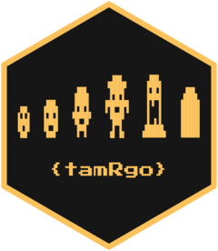

# {tamRgo} <a href="https://www.github.com/matt-dray/tamRgo"></a>

<!-- badges: start -->
[](https://www.repostatus.org/#concept)
[](https://github.com/matt-dray/tamRgo/actions)
[](https://app.codecov.io/gh/matt-dray/tamRgo?branch=main)
[](https://www.rostrum.blog/tags/tamRgo/)
<!-- badges: end -->

_Tamago_ (egg) + _uotchi_ ('watch') = [Tamagotchi](https://en.wikipedia.org/wiki/Tamagotchi). _Tamago_ + R = [{tamRgo}](https://github.com/matt-dray/tamRgo).

A concept R package that saves a digital pet to your computer who persists between sessions and whose stats update over time. You can interact with your pet in the R console.

## Install

Install {tamRgo} [from GitHub](https://www.github.com/matt-dray/tamRgo). There are no package dependencies, but you need R version 4 or higher.

``` r
install.packages("remotes")  # if not yet installed
remotes::install_github("matt-dray/tamRgo")
```

Basic instructions appear when you attach the package.

``` r
library(tamRgo)
```
``` r
# Welcome to {tamRgo}, a digital pet in the R console!
#  - Docs: <https://matt-dray.github.io/tamRgo>
#  - New pet: lay_egg()
#  - Then: get_stats(), see_pet(), play(), feed(), clean()
```

## How to

First, you simply lay an egg. A 'blueprint' of your pet is saved to your computer.

``` r
lay_egg(pet_name = "KEVIN")
```
``` r
# Save pet blueprint? y/n: y
# Saved pet blueprint.
# You have a new egg... it hatched!
# See its stats with get_stats()
```

You can print your pet's stats in the console.

``` r
see_stats()
```
``` r
# Characteristics
#   Name:    KEVIN
#   Species: Z
#   Age:     0
#   Level:   0 (newborn)
#   Alive:   TRUE
# Status
#   Happy:  ■■■□□ 
#   Hungry: ■■■□□
#   Dirty:  □□□□□
```

There he is, sweet little KEVIN.

``` r
see_pet()
```
``` r
# ░░░░░░░
# ░░███░░
# ░█░█░█░
# ░█████░
# ░██░██░
# ░░███░░
# ░░░░░░░
```

Your pet's stats will update over time, even when you aren't paying attention. You can `play()` with, `feed()` or `clean()` your pet to improve its status. 

Interact with your pet to accumulate (hidden) experience points that help it level up, change its appearance and, apparently, extend its life somehow.

You may `release_pet()` if you feel the time is right, which will erase the blueprint from your computer. Fare thee well, sweet KEVIN.

## Spoiler

The package's key mechanism is the persistent storage of a 'blueprint', an RDS file containing a list of pet-related values, which is saved to the path resolved by `tools::R_user_dir("tamRgo", which = "data")`. The values in the blueprint are updated when a player interacts with the pet, given the time that's elapsed since the last interaction. This gives the appearance that the pet lives 'in real time'.
